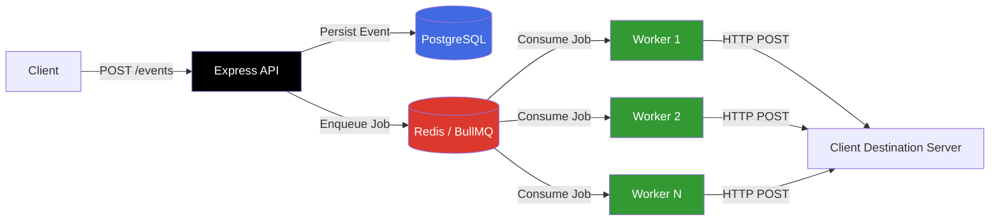

# Distributed Webhook Delivery System

[](https://nodejs.org/)
[](https://expressjs.com/)
[](https://www.typescriptlang.org/)
[](https://www.prisma.io/)
[](https://www.postgresql.org/)
[](https://redis.io/)
[](https://docs.bullmq.io/)
[](https://www.docker.com/)
[](#performance-benchmarks)

A production-grade, horizontally scalable webhook delivery platform built around a **CQRS (Command Query Responsibility Segregation)** architecture. The system decouples fast, non-blocking event ingestion from asynchronous, resilient background delivery — enabling high-throughput event intake with guaranteed at-least-once delivery to downstream destination servers.

---

## Table of Contents

- [System Architecture](#system-architecture)
- [Key Engineering Features](#key-engineering-features)
- [Performance Benchmarks](#performance-benchmarks)
- [Getting Started](#getting-started)
- [Observability](#observability)
- [Tech Stack](#tech-stack)

---

## System Architecture

The core design principle behind this system is separating the **write path** (ingestion) from the **read/delivery path** (dispatch), following a CQRS pattern. This ensures that the API's ability to accept events is never blocked or slowed down by the latency of delivering those events to third-party servers — which can be slow, unreliable, or entirely unresponsive.

**Flow:**
1. A client sends an event to the Express API.
2. The API synchronously persists the event to **PostgreSQL** (durable source of truth) and pushes a corresponding job onto a **Redis/BullMQ** queue — both operations complete before the client receives a response.
3. A fleet of distributed, horizontally scalable **workers** consume jobs from the Redis queue independently of the ingestion path.
4. Each worker executes the outbound **HTTP POST** to the client's registered destination server, handling retries and failures without impacting ingestion throughput.



Because ingestion and delivery are fully decoupled, workers can be scaled independently based on delivery volume and downstream latency, without ever putting ingestion throughput at risk.

---

## Key Engineering Features

- **High-Concurrency Ingestion** — The Express API accepts and persists incoming events without blocking the Node.js event loop, sustaining high request volume under load.
- **Asynchronous Message Queuing** — Events are queued via **Redis/BullMQ** with **at-least-once delivery** guarantees, ensuring no event is silently dropped even under worker failure.
- **Resilient Retry Logic** — Failed deliveries are automatically retried using **exponential backoff**, protecting both the system and downstream destinations from thundering-herd retry storms.
- **Automated CI/CD Pipeline** — GitHub Actions runs the full pipeline on every push: spins up an **ephemeral database** for integration testing, seeds it, and executes an **automated k6 load test** to catch performance regressions before merge.
- **Real-Time Observability** — Instrumented with **prom-client**, exposing granular application metrics scraped by a local **Prometheus** instance for real-time monitoring.

---

## Performance Benchmarks

The system was stress-tested using **Grafana k6** with **50 concurrent virtual users** sustained over the test duration.

| Metric              | Result                          |
|----------------------|---------------------------------|
| **Throughput**       | 640+ Requests / Sec             |
| **Error Rate**       | 0.00% (zero dropped events)      |
| **p95 Latency**      | 46.69 ms                        |
| **Total Events Processed** | 67,513+ events in 1m 45s   |

These results demonstrate that the CQRS-based decoupling holds up under sustained concurrent load — ingestion remained fast and error-free even as the delivery pipeline processed tens of thousands of queued jobs in parallel.

---

## Getting Started

### Prerequisites

- [Docker](https://www.docker.com/) & Docker Compose
- [Node.js](https://nodejs.org/) v18+

### Local Execution

**1. Clone the repository**
```bash
git clone https://github.com/your-username/distributed-webhook-delivery-system.git
cd distributed-webhook-delivery-system
```

**2. Build and start all services**
```bash
docker compose up -d --build
```
This spins up the Express API, PostgreSQL, Redis, BullMQ workers, and the Prometheus instance.

**3. Run the load test**
```bash
k6 run tests/load_test.js
```
This executes the k6 stress test suite against the running API and reports live throughput, latency, and error-rate metrics.

---

## Observability

- **Application Metrics:** The API exposes real-time telemetry (request rates, latencies, queue depth, error counts) at:
  ```
  http://localhost:3000/metrics
  ```
- **Prometheus Dashboard:** Metrics are scraped and queryable locally at:
  ```
  http://localhost:9090
  ```

---

## Tech Stack

| Layer            | Technology                     |
|-------------------|--------------------------------|
| API / Runtime     | Node.js, Express, TypeScript   |
| ORM               | Prisma                         |
| Database          | PostgreSQL                     |
| Queue / Broker    | Redis, BullMQ                  |
| Containerization  | Docker, Docker Compose         |
| CI/CD             | GitHub Actions                 |
| Load Testing      | Grafana k6                     |
| Observability     | prom-client, Prometheus        |

---

## License

This project is licensed under the [MIT License](LICENSE).